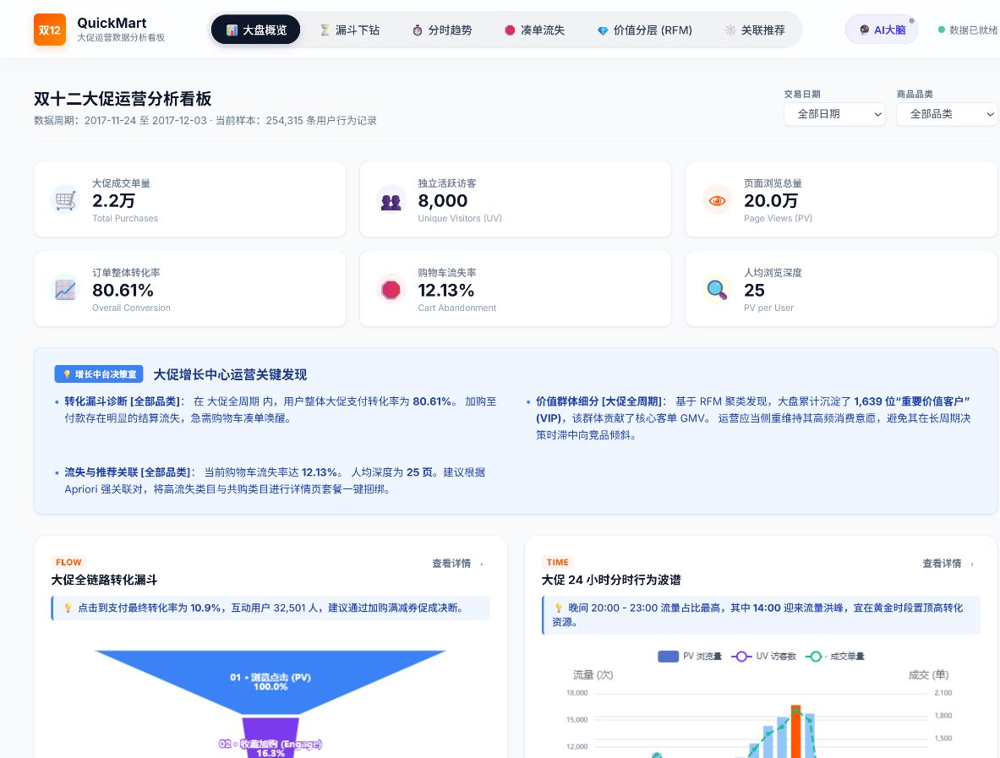
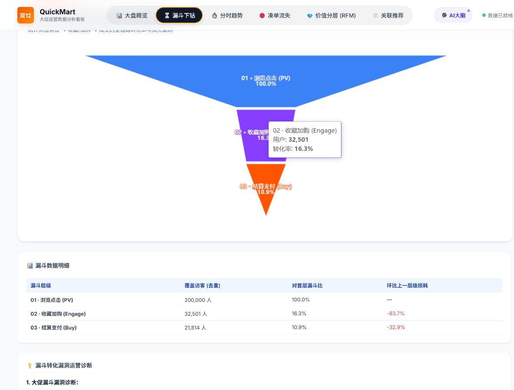
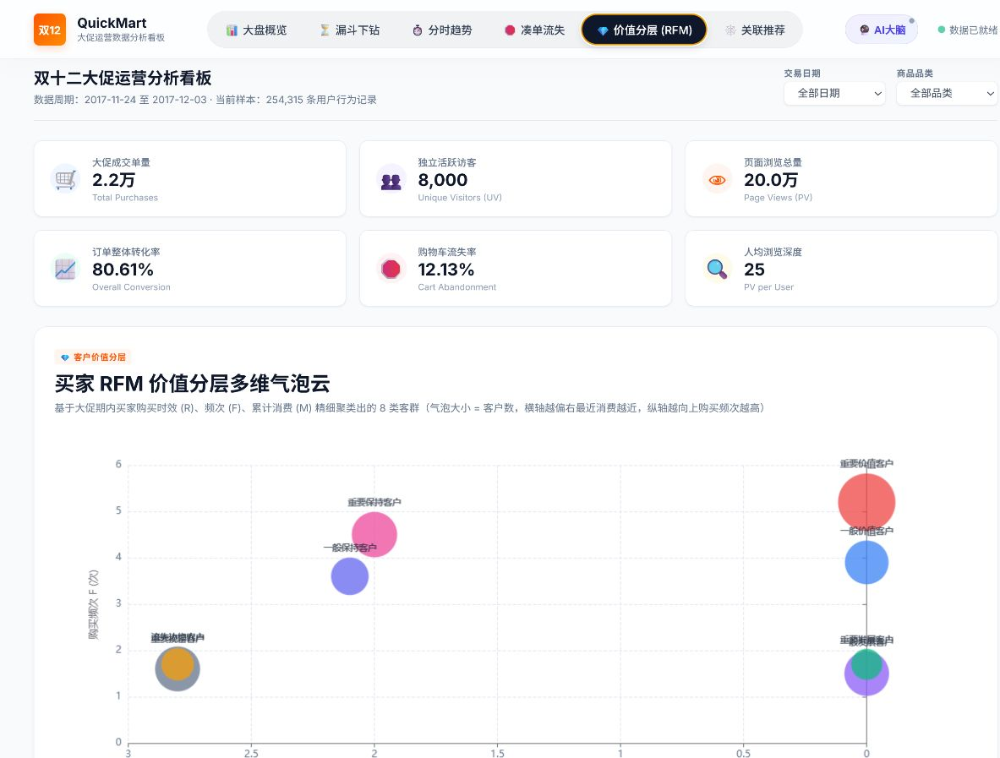
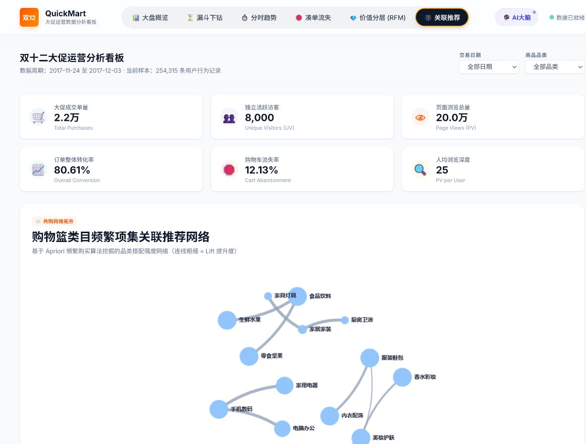
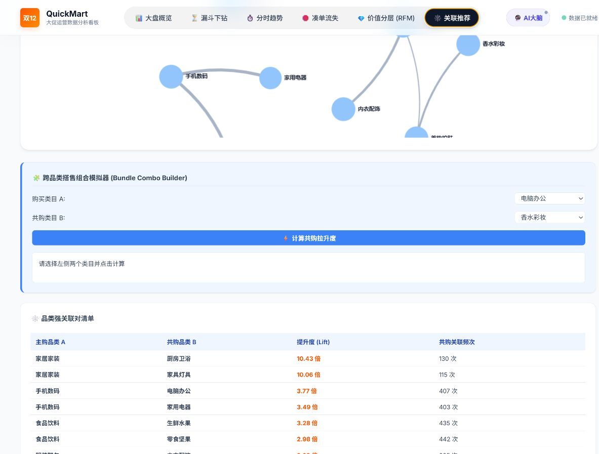
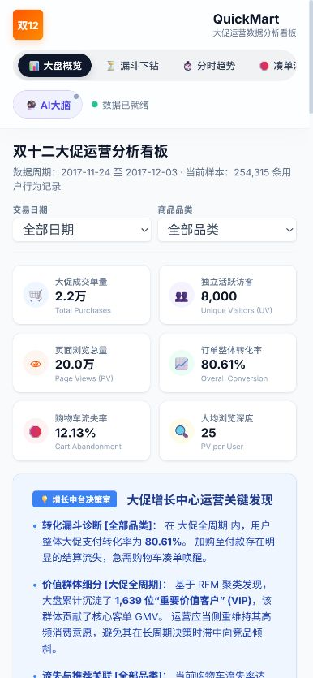

# Taobao Promotion Operations Analytics

面向电商大促复盘的用户行为分析与运营决策看板。系统使用 FastAPI + Pandas 对当前 CSV 样本进行筛选计算，通过 ECharts 呈现转化漏斗、时段需求、购物车流失、RFM 用户分层、品类关联和购买决策时滞。

> [在线演示](https://taobao-bi-engine.onrender.com) · [GitHub 仓库](https://github.com/xppdxkj/taobao-bi-engine) · [接口文档](https://taobao-bi-engine.onrender.com/docs)
>
> Render 免费实例闲置后会休眠，首次打开通常需要等待服务唤醒。页面出现“数据已就绪”后再开始操作。

## 项目解决什么问题

看板不是只展示成交总量，而是围绕大促运营的五个可执行问题组织分析：

| 运营问题 | 分析方法 | 决策输出 |
| --- | --- | --- |
| 用户在哪一段大量流失 | PV → 收藏/加购 → 支付漏斗 | 定位损耗最大的链路层级 |
| 哪些时段值得集中投放 | 小时级 PV、UV 与成交趋势 | 识别流量峰值与成交窗口 |
| 哪些品类加购后没有购买 | 品类购物车流失排行 | 选择凑单券和召回优先级 |
| 哪些用户值得重点维护 | RFM 八类客群分层 | 形成留存、唤醒与复购策略 |
| 哪些品类适合组合销售 | Apriori 共购、支持度与 Lift | 输出搭售组合和强关联对 |

## 当前数据口径

仓库内的数据由 `downloader.py` 按设定的日期、时段、品类权重、转化率与共购关系生成，用于复现分析流程；**不是淘宝生产数据，也不包含真实个人信息。**

| 指标 | 当前样本 |
| --- | ---: |
| 用户行为记录 | 254,315 条 |
| 去重用户 | 8,000 |
| 去重商品 | 20,000 |
| 商品品类 | 20 |
| 数据周期 | 2017-11-24 至 2017-12-03 |
| 内存 DataFrame | 约 9.46 MB |

样本规模、日期和内存占用由 `GET /api/meta` 从实际加载的数据动态返回，页面不再硬编码“50 万行”。

## 功能实景

以下截图来自当前本地构建，均已等待数据与 ECharts 图表完成加载。点击图片可在 GitHub 中查看原图。

### 1. 经营概览

同一页面汇总六项核心指标、关键经营结论与六类分析入口；日期和商品品类筛选会触发后端重新计算。



### 2. 转化漏斗下钻

漏斗同时给出去重用户覆盖、层级转化率和相对上一层损耗，避免只看一个总体转化率。



### 3. RFM 用户价值分层

横轴为最近购买时间，纵轴为购买频次，气泡大小代表客群规模；八类客群可继续下钻到规模、占比与运营建议。



### 4. 品类关联与搭售

系统先呈现共购网络，再给出可交互的组合计算器和 Lift 排行，用于复核搭售候选，而不是直接把相关性当成自动促销指令。





### 5. 手机端适配

390px 手机宽度下，导航可横向滑动，筛选器、KPI 卡片和经营结论重新排布为适合触控阅读的布局。

<p align="center">
  
</p>

## 已实现能力与边界

| 能力 | 状态 | 说明 |
| --- | --- | --- |
| 日期与品类联动筛选 | 已实现 | 后端按筛选条件重新计算 KPI、漏斗、时段和流失指标 |
| 转化、流失和时段分析 | 已实现 | 返回图表数据、明细表和规则诊断文本 |
| RFM 用户分层 | 已实现 | 基于最近购买、频次和估算金额划分八类客群 |
| Apriori 品类关联 | 已实现 | 计算共购次数、支持度和 Lift，并提供组合复核 |
| 指标详情弹窗 | 已实现 | 放大图表，同时展示明细与归因说明 |
| 本地规则诊断 | 默认启用 | 不依赖外部模型即可输出固定口径的运营解释 |
| 外部大模型诊断 | 可选 | 支持兼容 OpenAI / DeepSeek / Gemini 的 HTTP 配置；仓库不保存密钥 |
| Pandas 代码工作台 | 本地演示 | 当前端点会执行输入代码，只应在可信本地环境使用，不应直接暴露给不受信任用户 |
| 实时行为采集 | 未实现 | 当前是离线 CSV 样本，不宣称 Kafka、埋点或实时数仓已经上线 |
| 因果推断 | 未实现 | 页面结论用于描述样本关系，不把相关性表述为因果效果 |

## 数据与服务架构

```text
可复现 CSV 样本
      ↓
Pandas 类型优化与内存加载
      ↓
KPI / 漏斗 / 时段 / 流失 / RFM / Apriori / 时滞
      ↓
FastAPI JSON 接口
      ↓
原生 JavaScript + ECharts 交互看板
      ↓
筛选、下钻、模拟器与规则/可选 LLM 诊断
```

| 层次 | 技术 |
| --- | --- |
| 数据处理 | Python、Pandas、NumPy |
| 后端 | FastAPI、Uvicorn |
| 前端 | HTML、CSS、JavaScript、ECharts 5 |
| 分析方法 | 漏斗分析、分时统计、RFM、Apriori、决策时滞分布 |
| 部署 | Docker、Render Web Service |

## API

| 路径 | 用途 |
| --- | --- |
| `GET /api/meta` | 当前数据规模、日期范围和内存占用 |
| `GET /api/filters` | 日期与品类筛选项 |
| `GET /api/kpis` | 成交、UV、PV、转化率、流失率和浏览深度 |
| `GET /api/funnel` | 三层行为漏斗 |
| `GET /api/hourly` | 24 小时 PV、UV 与成交趋势 |
| `GET /api/cart-abandonment` | 品类购物车流失排行 |
| `GET /api/rfm` | 八类 RFM 客群 |
| `GET /api/association` | 品类共购网络与 Lift |
| `GET /api/latency` | 点击至购买决策时滞 |
| `GET /api/ai-analyze` | 本地规则或可选外部模型诊断 |

## 本地运行

```bash
git clone https://github.com/xppdxkj/taobao-bi-engine.git
cd taobao-bi-engine
pip install -r requirements.txt
python agent.py
```

打开 `http://127.0.0.1:8000`，接口文档位于 `http://127.0.0.1:8000/docs`。

Docker：

```bash
docker build -t taobao-bi-engine .
docker run --rm -p 8000:7860 taobao-bi-engine
```

## 项目结构

```text
├── data/user_behavior.csv       # 当前分析样本
├── static/
│   ├── index.html               # 页面结构
│   ├── style.css                # 桌面与手机响应式样式
│   ├── app.js                   # API 联动、图表和交互
│   └── screenshots/             # README 实景截图
├── agent.py                     # FastAPI 路由与静态页面服务
├── analyzer.py                  # 指标、RFM、关联和诊断逻辑
├── downloader.py                # 可复现样本生成器
├── requirements.txt
└── Dockerfile
```

## 部署说明

公开演示使用 GitHub + Render：

- Render 从本仓库构建 Docker 服务；
- 免费实例会休眠，首次访问存在冷启动延迟；
- 当前数据随镜像部署，不会因为访客操作而永久改变；
- 若要公开长期运行，应先关闭或鉴权 Pandas 代码执行端点，并增加持久化数据源和访问控制。

## License

代码和模拟数据仅用于个人作品展示与学习。
