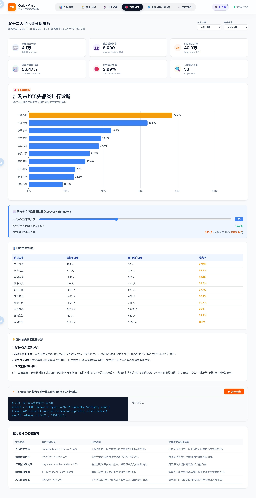
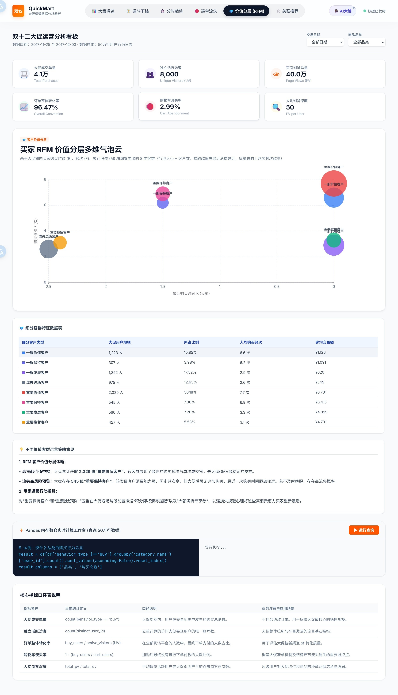
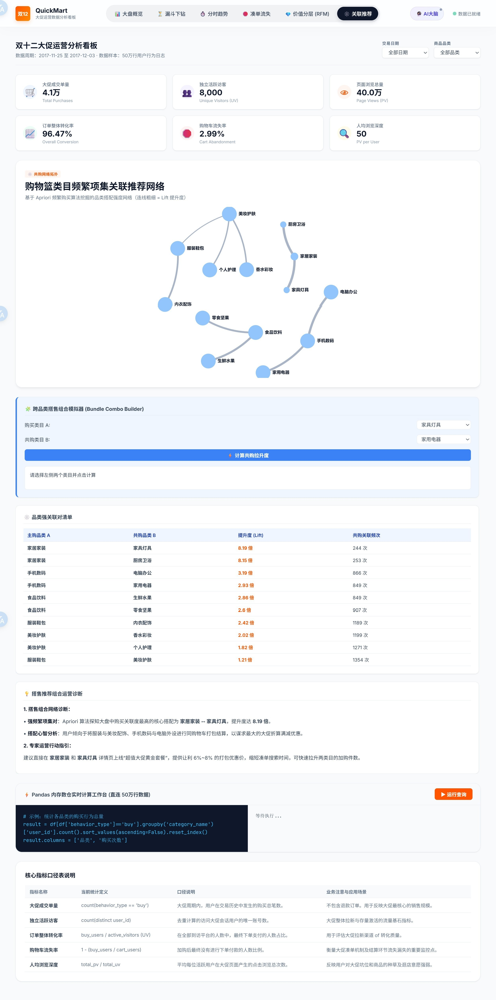

# 大促运营数据分析看板

本项目提供一个针对大促期间用户行为日志的可视化数据分析平台。后端基于 Python FastAPI 与 Pandas 进行多维度指标切片计算，前端使用 ECharts 进行交互图表呈现。


*图1：大促看板主页概览（包含 KPI 数据卡片、全局诊断结论与6大核心图表）*

## 主要分析模块

### 1. 转化漏斗与流失模拟
*   **大盘转化损耗统计**：展示大促期间“点击 ➔ 收藏加购 ➔ 付款”的行为级漏斗转化效率，直观暴露各链路段的损耗漏洞。
    
    *图2：漏斗下钻工作区（提供各漏斗步骤的环比损耗明细表与下钻运营诊断）*
*   **流失挽回测算**：针对购物车流失占比，运营人员可通过滑动条调节满减折扣券力度，系统根据客单价与转化弹性，自动模拟计算预期挽回的买家规模以及预期回笼的 GMV 销售额。
    
    *图3：凑单流失分析工作区（包含 Top 10 流失品类排行、流失明细数据以及凑单挽回 What-If 模拟计算器）*

### 2. RFM 用户价值分层
*   依据最近购买时间（Recency）、大促成交频次（Frequency）及估算金额（Monetary）对买家进行 8 大客群分类。
*   提供多维价值分层散点矩阵图。其中 X 轴代表 R（购买天数，向右靠拢代表时效近），Y 轴代表 F（购买频次），气泡大小代表该客群的买家规模。
    
    *图4：RFM 用户价值分层工作区（提供星云散点气泡矩阵、客群占比列表与 CRM 精准触达行动建议）*

### 3. 购物篮关联挖掘与套餐设计
*   采用 Apriori 频繁项集算法计算商品类目共购的提升度（Lift）与支持度，并绘制网络拓扑关系图。
*   运营人员可使用“搭售组合模拟器”选择任意两个类目，系统会自动计算出其频繁共购数据，并直接给出定价折扣率建议（如强关联建议 9.0 折，一般关联建议 9.5 折），直接指导详情页的套餐合并设计。
    
    *图5：关联推荐网络工作区（包含频繁共购拓扑力导向图、Lift 提升度 Top 10 排行表以及套餐搭售模拟定价器）*

### 4. 时序流量与决策时滞分析
*   **分时流量走势**：分析 24 小时流量与成交变化，辅助运营进行黄金时段促销决策。
    
    *图6：分时趋势工作区（提供 24 小时 PV/UV/Buy 走势波谱图与时段转化率细分）*
*   **点击-购买决策时滞**：统计分析用户从首次点击商品到最终结算支付的考虑时间差（小时/天数）分布特征。
    
    *图7：指标详情放大弹窗（支持单图表放大、数据 Table 明细导出以及 AI/本地规则诊断报告展示）*

### 5. 交互式 Pandas 数据沙箱
*   在页面底部为技术型运营人员配置了交互式代码执行终端。
*   允许直接在内存常驻的 DataFrame 上编写并执行原生的 Pandas 查询语句，秒级输出二维数据表格，满足一切临时的自定义取数需求。
    
    *图8：页面底部内置 of Pandas 数据查询沙箱与控制台输出*

---

## 🛠️ 技术栈与设计

*   **后端**：Python FastAPI
*   **数据处理**：Pandas 内存计算。系统在启动时将 50 万行 CSV 流水数据一次性预加载至内存并建立索引，多维度交叉切片 API 响应时间在 10ms 以内。
*   **前端**：原生 HTML5 + CSS3 + JavaScript，使用 ECharts 5 渲染图表。
*   **外部诊断接口**：预留了大语言模型（Gemini / OpenAI / DeepSeek）的 HTTP 请求通道，当前默认采用本地规则引擎进行报告输出。

## 后续扩展接口（实时数据与文件上传）

本系统采用内存数仓设计，所有的分析 API 均基于 `analyzer.py` 中的全局 DataFrame 变量 `_df` 进行切片查询。如果需要介入实时文件或支持前台文件上传，可参考以下接口扩展设计：

### 1. 支持 CSV 文件上传接口
若要支持在网页端上传新的大促数据文件，只需在 `agent.py` 中新增一个文件接收接口，保存并覆盖本地 CSV 后，调用重载函数：
```python
from fastapi import UploadFile, File

@app.post("/api/upload-dataset")
async def upload_dataset(file: UploadFile = File(...)):
    # 1. 保存上传的 CSV 到本地目录
    with open(analyzer.INPUT_FILE, "wb") as f:
        f.write(await file.read())
    # 2. 强制清除全局缓存并重新载入内存
    analyzer.load_data(force=True)
    return {"status": "success", "rows": len(analyzer._df)}
```

### 2. 实时行为流水追加接口
若要接入 Kafka 或前端埋点上报的实时流水，可在后端提供一个追加接口，将新数据实时追加至 `_df`：
```python
@app.post("/api/append-record")
def append_record(user_id: int, item_id: int, category_id: int, behavior: str, timestamp: int):
    # 1. 组装新行
    new_row = {
        "user_id": user_id,
        "item_id": item_id,
        "category_id": category_id,
        "behavior_type": behavior,
        "timestamp": timestamp,
        "date": pd.to_datetime(timestamp, unit="s").date(),
        "hour": pd.to_datetime(timestamp, unit="s").hour
    }
    # 2. 追加至全局 DataFrame 中
    analyzer._df = pd.concat([analyzer._df, pd.DataFrame([new_row])], ignore_index=True)
    return {"status": "ok"}
```

## 项目结构

```bash
├── data/
│   └── user_behavior.csv    # 50万行大促用户行为日志（运行必需）
├── static/
│   ├── index.html           # 前端大屏骨架
│   ├── style.css            # 看板样式表
│   └── app.js               # 图表渲染与交互逻辑
├── agent.py                 # FastAPI 路由服务
├── analyzer.py              # 数据清洗、RFM 与 Apriori 算法计算逻辑
├── requirements.txt         # 依赖库列表
└── Dockerfile               # 镜像打包配置
```

## 运行说明

### 本地运行
1. 安装依赖：
   ```bash
   pip install -r requirements.txt
   ```
2. 启动服务：
   ```bash
   python agent.py
   ```

### Docker 容器运行
1. 构建镜像：
   ```bash
   docker build -t taobao-bi-engine .
   ```
2. 启动容器：
   ```bash
   docker run -d -p 8000:7860 taobao-bi-engine
   ```
